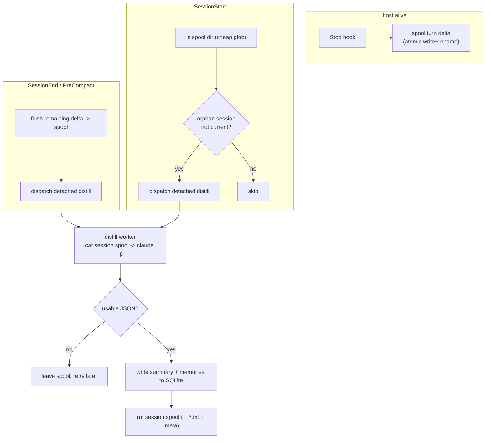

## Context

claude-brains captures via spawn-per-event hooks: `SessionEnd`/`PreCompact` run `distill.sh`, which reads the transcript tail and calls a headless `claude -p` (~25s) to produce a summary + memories. `SessionEnd` fires during host teardown; the gotcha `host_teardown_cancels_hooks` is that the host actively kills the shell process-group on exit/resume. The v1.1.1 detach (`setsid` + double-fork) is a **race** the worker loses intermittently, dropping the whole session silently — proven by `sif`/`2d913130` lost while `rp-digital` captured the same morning.

`no_daemon_architecture` rules out claude-mem's daemon. The insight: it is the **model call** that loses the race, not the data. claude-mem survives because it streams cheap raw `observation` events to a daemon and distills off the teardown path. We get the same property without a daemon by spooling the raw turn delta to **disk** on each `Stop` (host alive), and making distillation eventual.

Two earlier drafts were rejected: (1) a `turns` SQLite staging table + Stop hook — over-engineered and, per benchmark, slower on the hot path; (2) SessionStart transcript-scan backfill — the user correctly flagged that parsing every transcript at boot is slow. This design keeps per-turn capture but on disk, and makes recovery a cheap spool-dir glob rather than a transcript scan.

### Benchmark (this machine, ~2 KB turn payload)

| Operation | per-op (in-process) | per-call (real subprocess) |
|---|---|---|
| SQLite WAL insert | 0.84 ms | ~9 ms (`sqlite3` CLI) |
| disk write + fsync + rename | 0.79 ms | — |
| disk write + rename (no fsync) | 0.17 ms | — |
| `printf` → file | — | ~0.4 ms |

A hook is a fresh subprocess, so the right-hand column governs: disk is ~23× cheaper than the `sqlite3` CLI, plus it avoids the single-writer lock contended by the concurrent `fts-recall` hook.

## Goals / Non-Goals

**Goals:**
- Zero session loss from the teardown race: raw turns are on disk before teardown; a lost race delays condensation, never loses data.
- distill has a single source: the spool. No transcript re-read on the normal path.
- No daemon, no new SQLite table, no new dependency (honor `no_daemon_architecture`).
- Hot path (`Stop`) is a sub-ms file write; recovery (`SessionStart`) is a tiny directory glob, not a transcript scan.
- Crash-safe and idempotent: no partial consume, no duplicate, no orphan left forever.

**Non-Goals:**
- Pre-distilling per turn (a `claude -p` per `Stop`) — that is the expensive thing we are avoiding.
- Per-turn memory/summary updates — condensation stays batched.
- Changing recall (`inject.sh`/`fts-recall.sh`) or the `summaries`/`memories` schema.

## Decisions

### D1. Spool raw turns to disk on Stop; distill is eventual

`Stop` writes the new turn chunks as files; it never calls the model. The model call (distill) is decoupled and triggered by `SessionEnd`/`PreCompact` (flush+dispatch) and `SessionStart` (orphan recovery). The data is safe the instant it is on disk.

- **Why disk over SQLite staging:** ~23× cheaper per hook call (subprocess spawn dominates), no write-lock contention with `fts-recall`, atomic via `rename`, no migration. (Benchmark above.)
- **Why over a debounced Stop-distill:** a debounce leaves the turns between its last window and exit un-distilled if the exit race is lost — the original bug. Spooling every turn makes raw capture lossless regardless.

### D2. Flat spool layout with session-prefixed filenames

```
~/.claude/brains/spool/
  <session_id>__00001.txt     # raw "[role] text" chunk for turn idx 1
  <session_id>__00002.txt
  <session_id>.meta           # one line: cwd (project resolution without transcript)
```

- A session's turns = glob `<session_id>__*.txt`, ordered lexically by zero-padded idx.
- `.meta` lets distill resolve `project_id` from cwd without touching the transcript (true single-source).
- **Why flat over per-session subdir:** equivalent cleanup via glob, one fewer `mkdir` per session, simpler `ls` at recovery. (Chosen by the user.)

### D3. High-water mark derived from spool filenames

The last spooled index for a session = max idx among `<session_id>__*.txt`. `Stop` parses the transcript into the ordered list of text turns, takes those with index > mark, writes them. No side-file mark to desync; `rename` + existence check make re-spooling a no-op.

- `idx` = position in the filtered user/assistant text-turn list (same jq filter distill already uses), stable and monotonic, robust to interleaved non-message records (`file-history-snapshot`, `queue-operation`).

### D4. Atomic write = crash defense

Write to `spool/.<session_id>__<idx>.partial`, then `rename()` to the final name. POSIX `rename` is atomic, so a process killed mid-write leaves only a `.partial` (ignored by distill). fsync is omitted: we defend against **process kill** (rename covers it), not power loss; skipping fsync is ~5× faster.

Layered defense for "exit before the last artifact finishes":
1. Atomic rename — never consume a partial.
2. Per-turn granularity — at most the single in-flight turn at risk, never the session.
3. Self-healing delta (D3) — a missed `Stop` is caught by the next.
4. `SessionEnd`/`PreCompact` flush — a fast file write of the remaining delta that almost always beats teardown (vs the 25s `claude -p` that lost).
5. Idempotent distill (D6) — safe to re-run.

The only genuinely unrecoverable case is an interrupted final turn with no subsequent `Stop` and a lost flush race — bounded to one turn, documented.

### D5. distill consumes spool, then deletes — single source

`distill.sh` worker:
1. `cat` the session's `__*.txt` in idx order → prompt input (same 24 KB cap, same isolated `claude -p`).
2. Resolve project from `.meta` cwd.
3. On usable JSON: write summary + memories (existing idempotent upserts) **then** `rm` the session's spool files (`__*.txt` + `.meta`).
4. On empty/garbage: leave spool intact for retry.
5. Fallback: if spool empty but a transcript exists (first run after upgrade), use the legacy transcript-tail path.

- Delete-after-write ordering: a crash between write and delete re-runs as an idempotent upsert (memories keyed by project/title, summary per session), then deletes. No loss, no duplicate.

### D6. Recovery is a spool-dir glob, not a transcript scan

`SessionStart` runs `recover-spool.sh`: `ls` the spool dir, group leftover files by `session_id`, skip the starting session, dispatch the detached distill for each remaining session. This is microseconds (small dir) versus parsing MB of transcripts — directly addressing the "slow boot" objection. A race-lost session is exactly a session whose spool was never deleted, so the glob finds it.

### D7. SessionEnd/PreCompact become flush + dispatch

They no longer read the transcript to distill. They flush the remaining delta to the spool (same code as `Stop`) and dispatch the detached distill worker. The flush is the teardown-resilient guarantee; the detached distill is best-effort and, if it loses, recovery (D6) covers it.

## Flow



## Risks / Trade-offs

- **[Interrupted final turn, no Stop, lost flush]** → Bounded to one turn (not the session). Mitigation: flush is sub-ms and usually wins; accept the single-turn edge.
- **[Spool grows if distill keeps failing]** → Files accumulate for a session whose model call never succeeds. Mitigation: failures are rare (isolated/robust parser already in place); add a recovery-time prune of spool older than N days as a backstop.
- **[Concurrent SessionEnd worker and SessionStart recovery hit the same session]** → Both consume the same spool. Mitigation: idempotent upsert + delete; whoever finishes first deletes, the other finds empty spool and exits. Low risk.
- **[`.meta` missing/corrupt]** → distill cannot resolve project. Mitigation: `.meta` is written atomically once; if absent, distill falls back to the transcript's cwd (transcript path is recoverable from session_id) or skips, leaving spool for retry.
- **[idx drift if transcript schema changes]** → Same jq filter as distill; both break together, covered by existing parser-robustness work.

## Migration Plan

1. Create `spool/` lazily on first write; nothing to migrate.
2. Add `spool-turn.sh` + `Stop` hook → turns start accumulating.
3. Rework `distill.sh` to spool-source with the legacy transcript-tail fallback (so the rollout window loses nothing).
4. Switch `SessionEnd`/`PreCompact` to flush+dispatch; add `recover-spool.sh` to `SessionStart`.
5. **Rollback:** remove `Stop` and recovery commands from `hooks.json`; revert `SessionEnd`/`PreCompact` to direct distill (legacy path still present). Delete the inert `spool/` dir. No schema/data migration to reverse.

## Open Questions

- Spool prune policy: prune at recovery (once per boot) vs in `db-init` (every hook). Leaning recovery-time, files older than 7 days. Resolved as default; not a blocker.
- `.meta` content: cwd only (proposed) vs cwd + project_slug cached. Leaning cwd-only; project resolution already cheap. Not a blocker.
